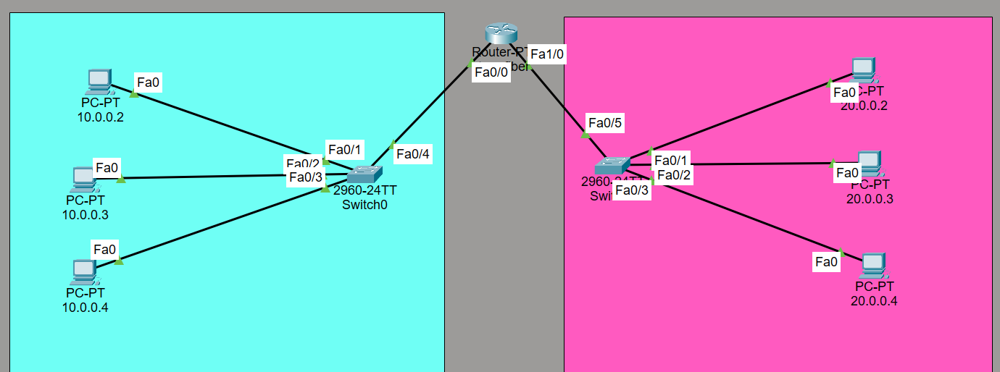
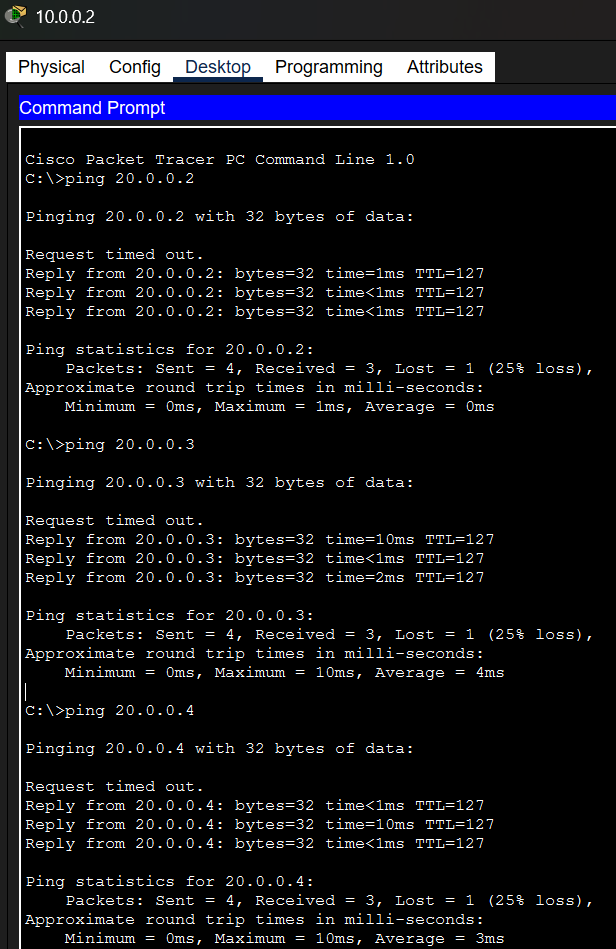
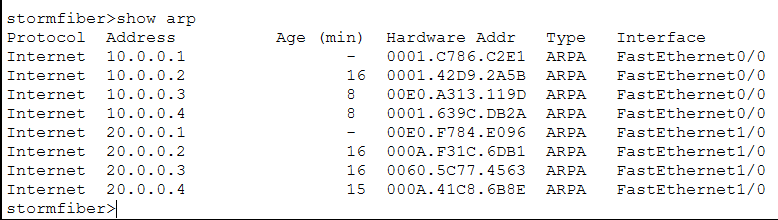
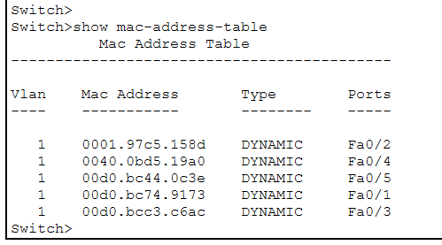

# Cisco Packet Tracer Routing Lab
A network topology built using two switches, a router, and PCs to practice routing and network fundamentals.

## Network Topology

## Ping Test

## ARP Table

## MAC Address Table

## Concepts Practiced
- IP addressing
- Router configuration
- Switch MAC address table
- Router ARP table
- Ping connectivity testing
- Basic device security (enable secret)
