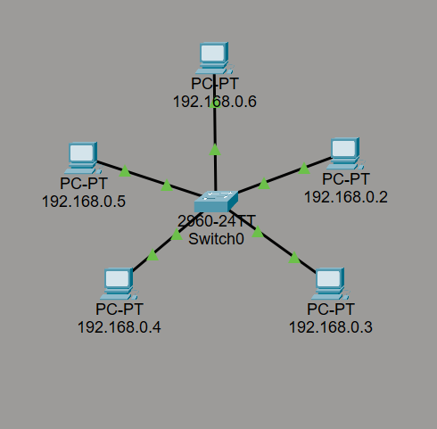

# Basic LAN Setup
A simple LAN network built in Cisco Packet Tracer using a switch connected to 5 PCs.

## Topology

## Ping Test

## MAC Address Table

## Concepts Practiced
- Switch configuration
- MAC address table
- IP addressing
- Ping connectivity testing
